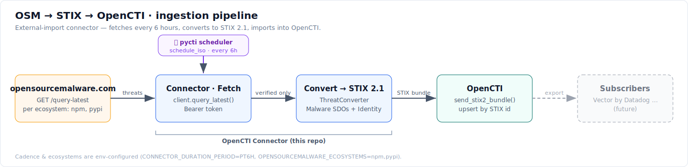

# OpenCTI — Open Source Malware Connector

An [OpenCTI](https://www.opencti.io) `EXTERNAL_IMPORT` connector that pulls the
latest verified malicious packages from
[opensourcemalware.com](https://opensourcemalware.com), maps each one to a STIX
**Malware** object, tags it with a configurable **label**, and imports it into
OpenCTI.

## Architecture



The connector runs on a schedule (`schedule_iso`, every `PT6H` by default):
fetch the latest threats per ecosystem from opensourcemalware.com, keep only
`verified` records, convert each to a STIX 2.1 `Malware` object, and import the
bundle into OpenCTI (which upserts by deterministic STIX id). Downstream fan-out
to subscribers such as Vector by Datadog is not yet implemented.

## What it does

- Calls the free `query-latest` API for each configured ecosystem (`npm`, `pypi`, …).
- Converts every threat record into a STIX 2.1 `Malware` SDO:
  - **name**: `package@version (ecosystem)`
  - **description**: threat + payload descriptions and metadata
  - **labels**: the configured connector label (`opensourcemalware`), the
    source's own tags, and `severity:<level>`
  - **score**: derived from `severity_level`
  - **external references**: the source record id plus OSV/GHSA advisory links
    when present
- All objects are attributed to an `Open Source Malware` organization identity.
- Runs on a schedule (`CONNECTOR_DURATION_PERIOD`, default every 6 hours).

## Configuration

Configure via environment variables (see `docker-compose.yml`) **or** a
`src/config.yml` file (copy `src/config.yml.sample`). Environment variables take
precedence.

| Parameter | Env var | Default | Description |
|-----------|---------|---------|-------------|
| API base URL | `OPENSOURCEMALWARE_API_BASE_URL` | `https://api.opensourcemalware.com/functions/v1` | API root |
| API token | `OPENSOURCEMALWARE_API_TOKEN` | — | Bearer token (free API) |
| Ecosystems | `OPENSOURCEMALWARE_ECOSYSTEMS` | `npm,pypi` | Comma-separated list to query |
| Label | `OPENSOURCEMALWARE_LABEL` | `opensourcemalware` | Label added to every imported object |
| Verified only | `OPENSOURCEMALWARE_VERIFIED_ONLY` | `true` | Skip non-`verified` records |
| Run interval | `CONNECTOR_DURATION_PERIOD` | `PT6H` | ISO-8601 duration between runs |

Plus the standard `OPENCTI_URL`, `OPENCTI_TOKEN`, `CONNECTOR_ID` (a fresh UUIDv4).

## Run

### Docker

```bash
export OPENCTI_TOKEN=...           # your OpenCTI admin/connector token
export CONNECTOR_ID=$(uuidgen)
export OPENSOURCEMALWARE_API_TOKEN=$(cat .api-token)
docker compose up -d --build
```

### Locally

```bash
pip install -r requirements.txt
cp src/config.yml.sample src/config.yml   # then fill in values
python src/connector.py
```

## Continuous Integration

A GitHub Actions pipeline (`.github/workflows/ci.yml`) runs on every push/PR
(and the uptime check additionally on a 6-hour cron):

| Job | Tool | Purpose |
|-----|------|---------|
| `secret-scan` | [gitleaks](https://github.com/gitleaks/gitleaks) (`.gitleaks.toml`) | Fails the build if an API key, token, or non-placeholder OpenCTI endpoint is committed |
| `lint` | [ruff](https://docs.astral.sh/ruff/) (`ruff.toml`) | `ruff check` + `ruff format --check` |
| `docker-build-test` | `docker build` + `pytest --cov` | Builds the image, runs the unit tests, and produces a coverage report (rendered in the run **Summary** and uploaded as the `coverage-report` artifact: HTML + `coverage.xml`) |
| `endpoint-health` | `curl` | **Non-blocking** probe of the opensourcemalware API; only a 5xx / unreachable host counts as down (a 3rd-party outage won't fail your pipeline) |

Run the checks locally:

```bash
pip install ruff pytest pytest-cov -r requirements.txt
ruff check . && ruff format --check .
pytest -q                                    # just run the tests
pytest --cov=src --cov-report=term-missing   # with a coverage report
pytest --cov=src --cov-report=html           # writes browsable coverage-html/
```

> **Security:** real tokens/endpoints must never be committed. `docker-compose.yml`
> ships with `ChangeMe` placeholders; supply real values via your shell
> environment or an un-tracked `.env` / `src/config.yml` (both are git-ignored).
> If a secret is ever pushed, **rotate it** — removing it from the current file
> does not purge it from git history.

## Notes

- The free `query-latest` endpoint returns up to the 100 most recent threats per
  ecosystem; the connector re-fetches on each run. OpenCTI deduplicates by the
  deterministic STIX id, so repeated runs upsert rather than duplicate.
- The label is created automatically in OpenCTI on first ingest if it doesn't
  already exist.
